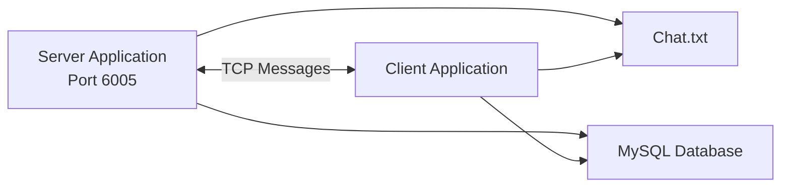

# Java Client–Server Chat Application

A desktop chat application developed using **Java Swing** and **TCP socket programming**. It provides separate server and client interfaces for real-time, one-to-one messaging.

This application was developed as a semester project for the **Advanced Programming Language (Java)** course.

## Features

- Real-time messaging between a server and a client
- Desktop graphical interface built with Java Swing
- TCP communication using `ServerSocket` and `Socket`
- Incoming and outgoing chat bubbles
- Message timestamps
- Typing-status indicator
- Local message history stored in `Chat.txt`
- Optional message storage in a MySQL database
- Scrollable chat interface

## Technologies Used

- Java 8
- Java Swing and AWT
- Java Socket Programming
- JDBC
- MySQL
- Apache Ant
- NetBeans IDE

## Application Architecture

The server listens for a connection on TCP port `6005`. The client connects to the server through `127.0.0.1:6005`.

Messages are exchanged using `DataInputStream` and `DataOutputStream`. Each sent message is also appended to `Chat.txt` and stored in the MySQL database when the database connection is configured.



## Project Structure

```text
ChatApp-IN-JAVA-master/
├── src/
│   └── sem_project/
│       ├── Server.java
│       ├── Client.java
│       └── icons/
├── nbproject/
├── Chat.txt
├── build.xml
├── manifest.mf
└── README.md
```

## Prerequisites

Before running the application, install:

- JDK 8 or later
- NetBeans IDE or another Java IDE
- MySQL Server, if database storage is required
- MySQL Connector/J JDBC driver

## Database Configuration

The current source code uses the following MySQL configuration:

```text
Host: localhost
Port: 3306
Database: chatdb
Username: root
Password: empty
```

Create the required database and tables:

```sql
CREATE DATABASE chatdb;

USE chatdb;

CREATE TABLE server_msg (
    message TEXT
);

CREATE TABLE Client_msg (
    message TEXT
);
```

The JDBC connection is currently configured directly inside `Server.java` and `Client.java`:

```java
DriverManager.getConnection(
    "jdbc:mysql://localhost:3306/chatdb",
    "root",
    ""
);
```

Update these values according to your local MySQL configuration.

> The chat connection can still start without MySQL, but the application will display a database connection error when a message is sent.

## How to Run the Application

### Using NetBeans

1. Clone or download this repository.
2. Open the following folder as a NetBeans project:

   ```text
   ChatApp-IN-JAVA/ChatApp-IN-JAVA-master
   ```

3. Add the MySQL Connector/J library to the project if database storage is required.
4. Start MySQL and create the required database and tables.
5. Run `Server.java` first.
6. Run `Client.java` second.
7. Enter a message and click **Send**.

The server must be running before the client attempts to connect.

## Running on Two Computers

The application uses `127.0.0.1`, so the server and client run on the same computer by default.

To use the application on two computers connected to the same network:

1. Run `Server.java` on the first computer.
2. Find the local IP address of the server computer.
3. Open `Client.java`.
4. Replace:

   ```java
   new Socket("127.0.0.1", 6005);
   ```

   with:

   ```java
   new Socket("SERVER_IP_ADDRESS", 6005);
   ```

5. Allow TCP port `6005` through the server computer’s firewall.
6. Run `Client.java` on the second computer.

## Message Storage

Every sent message is appended to:

```text
Chat.txt
```

Messages sent from the two application windows are also stored in separate MySQL tables:

- `server_msg`
- `Client_msg`

## Current Limitations

- The application supports only one server and one client per session.
- The server address and port are hard-coded.
- Database credentials are hard-coded.
- Messages are transmitted without encryption.
- The application opens a new database connection for every message.
- Phone and video-call icons are visual elements only.
- The application does not currently support user registration or authentication.

## Future Improvements

Possible improvements include:

- Supporting multiple clients
- Adding user registration and authentication
- Moving database settings to a configuration file
- Encrypting network communication
- Displaying previous messages after restarting the application
- Adding file and image sharing
- Adding online and offline user status
- Improving database connection management
- Adding voice and video-call functionality

## Project Demo

A complete demonstration of the project is available on YouTube:

[Watch the Java Chat Application Demo](https://www.youtube.com/watch?v=oWaA5NBB3yM)

## Author

**Irfan Khan**

This repository is part of my software-development portfolio.
