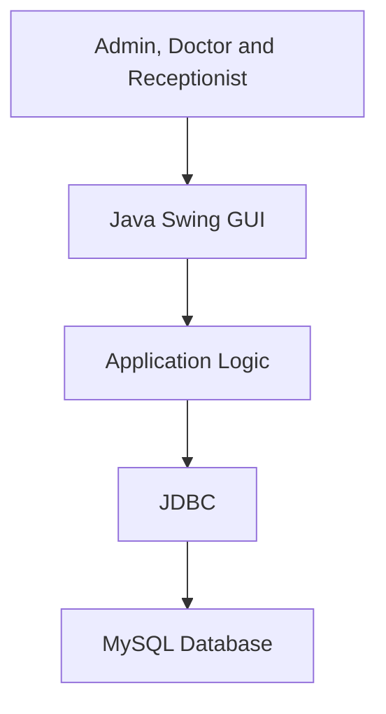

# Hospital Management System

A desktop-based Hospital Management System developed using **Java Swing, JDBC, and MySQL**. The application provides graphical interfaces for managing patients, doctors, receptionists, appointments, hospital beds, medicines, employees, and billing records.

This application was developed as a semester project for the **Advanced Programming Language (Java)** course.

## Features

- Role-based login for administrators, doctors, and receptionists
- Patient registration and record management
- Add, search, update, view, and delete patient records
- Doctor registration and profile management
- Add, search, update, view, and delete doctor records
- Receptionist and employee management
- Hospital department management
- Bed availability and allocation management
- Medicine and pharmacy record management
- Appointment creation and viewing
- Patient history management
- Hospital billing functionality
- Patient and doctor photograph support
- User-friendly Java Swing interface

## Technologies Used

- Java
- Java Swing
- Java AWT
- JDBC
- MySQL
- NetBeans IDE
- Apache Ant

## Additional Libraries

The project uses several external Java libraries:

- MySQL Connector/J
- rs2xml
- JCalendar
- DateChooser
- JTimeChooser
- JTattoo
- Beans Binding
- Absolute Layout

## System Architecture

The application follows a desktop application architecture in which Java Swing interfaces communicate directly with a MySQL database through JDBC.



## User Roles

### Administrator

The administrator can manage the main hospital records and system users, including:

- Doctors
- Patients
- Receptionists
- Employees
- Departments
- Beds
- Medicines
- System records

### Doctor

The doctor interface provides access to relevant patient information and hospital activities, including:

- Viewing assigned patient records
- Accessing patient details
- Reviewing appointments
- Viewing patient history

### Receptionist

The receptionist can perform front-desk hospital operations, including:

- Registering patients
- Searching patient records
- Managing appointments
- Selecting doctors
- Assigning hospital beds
- Supporting billing operations

## Main Modules

The project contains the following major modules:

- Authentication and role-based login
- Administration panel
- Patient management
- Doctor management
- Receptionist management
- Employee management
- Department management
- Bed management
- Medicine management
- Appointment management
- Patient history
- Billing

## Project Structure

```text
HospitalManagementSystem/
├── src/
│   ├── HospitalManagementSystem.java
│   ├── Index.java
│   ├── Adminlogin.java
│   ├── adminpanel.java
│   ├── doctorlogin.java
│   ├── doctoractivity.java
│   ├── ReceptionistLogin.java
│   ├── ReceptionitActivity.java
│   ├── PatientDetails.java
│   ├── DoctorDetails.java
│   ├── receptionistdetails.java
│   ├── employeesdetails.java
│   ├── DepartmentDetails.java
│   ├── bed.java
│   ├── medicinedetails1.java
│   ├── viewappointment.java
│   ├── history.java
│   ├── bill.java
│   ├── Java Swing form files
│   └── Images and icons
├── nbproject/
├── build.xml
├── manifest.mf
├── Patientphoto
└── README.md
```

## Prerequisites

Before running the application, install the following:

- JDK 7 or later
- NetBeans IDE
- MySQL Server
- MySQL Connector/J
- Required external JAR libraries

## Database Configuration

The application connects to the following MySQL database:

```text
Host: localhost
Port: 3306
Database: hospitalmanagementsystem
Username: root
```

Create the database before running the project:

```sql
CREATE DATABASE hospitalmanagementsystem;
```

The Java files currently contain database connections similar to:

```java
Class.forName("com.mysql.jdbc.Driver");

Connection conn = DriverManager.getConnection(
    "jdbc:mysql://localhost:3306/hospitalmanagementsystem?useSSL=false",
    "root",
    "your_password"
);
```

Replace the username and password with your own MySQL credentials.

> Database credentials are currently defined directly in multiple Java classes. For a production application, they should be moved to an external configuration file or environment variables.

## Database Tables

Based on the application modules, the database requires tables for records such as:

- Administrators
- Doctors
- Patients
- Receptionists
- Employees
- Departments
- Beds
- Medicines
- Appointments
- Patient history
- Bills

The table names and columns must match the SQL queries used in the Java source files.

## Setting Up the Project

1. Clone the repository:

   ```bash
   git clone https://github.com/Irfankhan132/MyWork.git
   ```

2. Open NetBeans IDE.

3. Select **File → Open Project**.

4. Open the following folder:

   ```text
   MyWork/HospitalManagementSystem
   ```

5. Add the required JAR files to the project libraries:

   - MySQL Connector/J
   - rs2xml
   - JCalendar
   - DateChooser
   - JTimeChooser
   - JTattoo

6. Create the `hospitalmanagementsystem` database in MySQL.

7. Create or import the required database tables.

8. Update the database username and password inside the Java source files.

9. Clean and build the project.

10. Run the main application class.

## Important Dependency Note

The NetBeans project configuration contains library paths from the computer on which the project was originally developed. These paths may not exist on another computer.

If NetBeans reports missing references:

1. Right-click the project.
2. Select **Properties**.
3. Open **Libraries**.
4. Remove the broken references.
5. Add the required JAR files from their locations on your computer.
6. Clean and rebuild the project.

## Application Workflow

1. The user starts the desktop application.
2. The user selects or opens the appropriate login interface.
3. The user logs in as an administrator, doctor, or receptionist.
4. The system validates the login information using the database.
5. The corresponding dashboard is displayed.
6. The user performs operations based on the assigned role.
7. The application reads or updates hospital records through JDBC.

## Current Limitations

- Database credentials are hard-coded in the source files.
- Several external library paths are specific to the original development computer.
- Some image paths use absolute Windows file-system locations.
- The application requires manual database configuration.
- The user interface was designed for desktop use.
- The application does not provide a REST API or web interface.
- Passwords should be securely hashed before production use.
- Database connections are created directly inside individual interface classes.

## Future Improvements

Possible improvements include:

- Applying a layered MVC architecture
- Centralizing database connection management
- Moving configuration to environment variables
- Adding secure password hashing
- Adding input validation and better error handling
- Replacing absolute image paths with relative resource paths
- Using Maven or Gradle for dependency management
- Adding automated unit and integration tests
- Implementing database migrations
- Adding report generation and data visualization
- Creating a web or mobile interface
- Adding audit logs and access-control permissions

## Project Demo

Watch the complete project demonstration on YouTube:

[Hospital Management System – Project Demo](https://www.youtube.com/watch?v=hqUJSI4WCHQ&t=71s)

## Author

**Irfan Khan**

This project is part of my software-development portfolio and demonstrates my experience with Java programming, Java Swing GUI development, JDBC, MySQL, and desktop application design.
