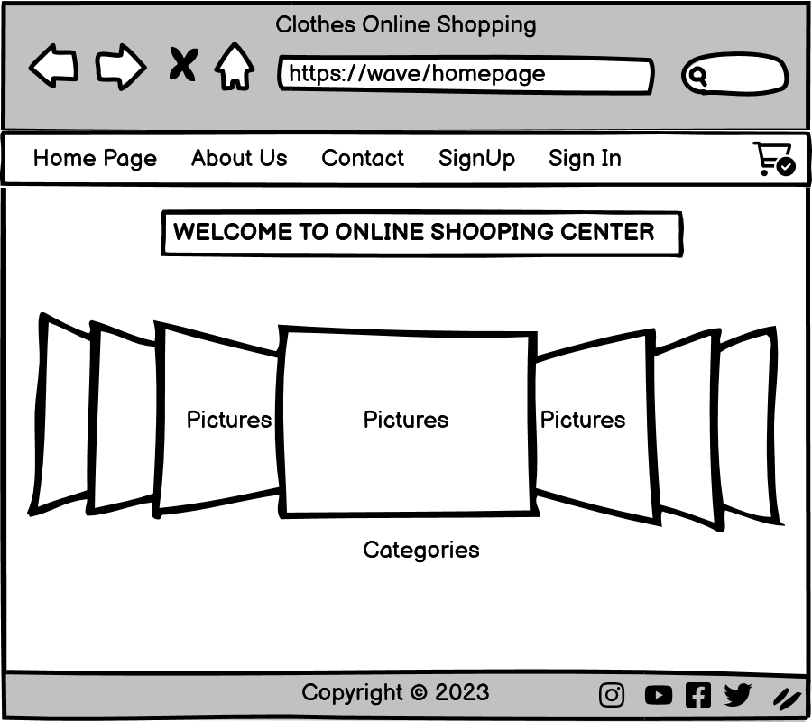
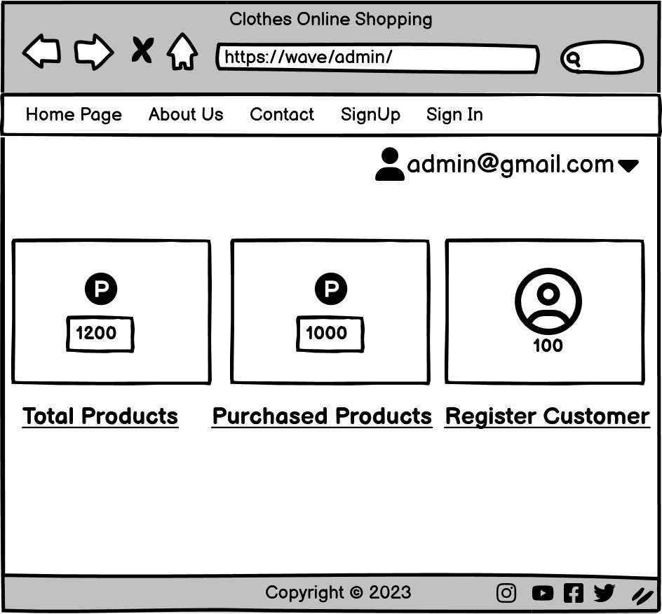
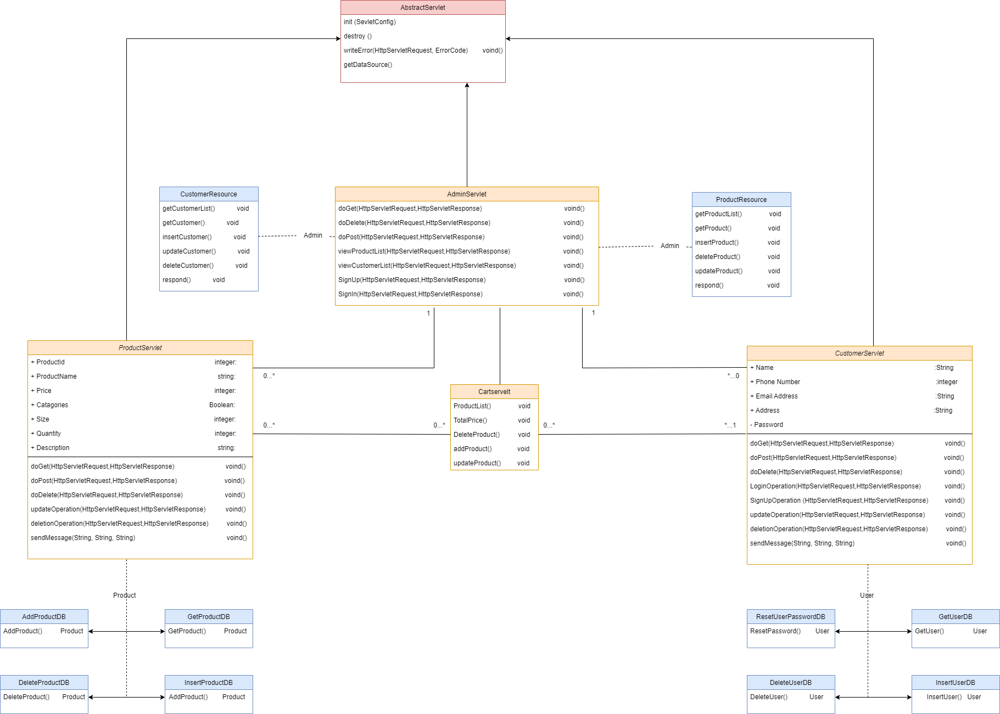
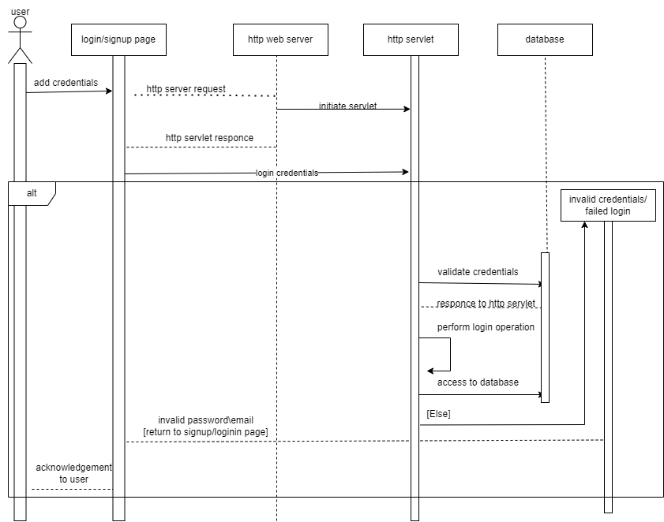

# WAVE — Online Clothing Store

WAVE is a Java-based web application for managing an online clothing store. It provides a public storefront with product categories and an administration area for managing products, customers, and administrator accounts.

The application was developed as a group project for the **Web Applications** course in the Master’s Degree in Computer Engineering at the **University of Padua, Italy**.

## Main Features

### Public Storefront

* Responsive clothing-store homepage
* Product sections for men, women, and children
* Product-detail and shopping-cart interface designs
* About Us and Contact Us pages
* Customer registration interface

### Administration

* Administrator registration and authentication
* Session-based administrator access
* Administrator logout
* Add, view, edit, and delete products
* Add, view, edit, and delete customers
* PostgreSQL-backed data persistence
* Prepared SQL statements for database operations

## Technology Stack

| Layer              | Technologies                            |
| ------------------ | --------------------------------------- |
| Backend            | Java, Jakarta/Java Servlets, JDBC       |
| Frontend           | JSP, HTML5, CSS3, JavaScript, Bootstrap |
| Database           | PostgreSQL                              |
| Build tool         | Apache Maven                            |
| Application server | Apache Tomcat                           |
| Logging            | Apache Log4j 2                          |
| Modelling          | Draw.io, ER diagram, sequence diagram   |
| Documentation      | LaTeX                                   |

## Application Architecture

WAVE follows a layered web-application architecture:

1. **Presentation layer** — JSP pages, HTML, CSS, JavaScript, and Bootstrap provide the user interface.
2. **Business layer** — Java Servlets process HTTP requests, manage sessions, and coordinate application operations.
3. **Data-access layer** — JDBC and prepared statements connect the application to PostgreSQL and perform database operations.

## Project Structure

```text
JavaProject/
├── ClassDiagram/              # Application class diagram
├── SequenceDiagram/           # Application sequence diagram
├── code/                      # Supporting project files
├── homework-1/                # Design and technical documentation
│   ├── images/                # Diagrams and interface images
│   ├── sections/              # LaTeX report sections
│   └── report.pdf             # Project design report
├── homework-2/
│   ├── wave/
│   │   ├── pom.xml            # Maven configuration
│   │   └── src/main/
│   │       ├── java/          # Java Servlet source code
│   │       └── webapp/        # JSP pages and frontend assets
│   └── wave.pptx              # Project presentation
├── mockup/                    # User-interface mockups
├── results/                   # Project results
├── slides/                    # Presentation material
├── Report_Sample.pdf
└── README.md
```

## Implemented Servlets

| Servlet                     | Responsibility                   |
| --------------------------- | -------------------------------- |
| `AdminRegisteration`        | Creates administrator accounts   |
| `AdminLogin`                | Authenticates administrators     |
| `Logout`                    | Ends the administrator session   |
| `CreateProductServlet`      | Adds products to the database    |
| `ProductListServlet`        | Retrieves and displays products  |
| `EditProductServlet`        | Retrieves a product for editing  |
| `EditForProductServlet`     | Updates product information      |
| `DeleteProductServlet`      | Deletes products                 |
| `CreateCustomerServlet`     | Adds customer records            |
| `CustomerListServlet`       | Retrieves and displays customers |
| `EditCustomerServlet`       | Retrieves a customer for editing |
| `EditForCustomerServlet`    | Updates customer information     |
| `DeleteCustomerDataServlet` | Deletes customer records         |

## User-Interface Preview

### Home Page



### Administrator Page



### Product Management


### Customer Management


## System Design

### Class Diagram



### Sequence Diagram



Additional interface mockups, the ER model, and technical documentation are available in the `mockup` and `homework-1` directories.

## Prerequisites

Before running the application, install:

* Java Development Kit 19
* Apache Maven 3.8 or later
* Apache Tomcat 9
* PostgreSQL
* An IDE with Java web-application support, such as IntelliJ IDEA Ultimate or Eclipse Enterprise Edition

## Getting Started

### 1. Clone the repository

```bash
git clone https://github.com/Irfankhan132/MyWork.git
cd MyWork/JavaProject/homework-2/wave
```

### 2. Create the PostgreSQL database

Start PostgreSQL and create a database named `wave`:

```sql
CREATE DATABASE wave;
```

The application expects tables for administrators, customers, and products. Configure their fields according to the SQL operations used by the Servlets.

### 3. Configure the database connection

Update the PostgreSQL connection configuration in the Java Servlet files:

```java
String url = "jdbc:postgresql://localhost:5432/wave";
String username = "your_postgresql_username";
String password = "your_postgresql_password";
```

For production use, database credentials should be stored in environment variables or configured through a Tomcat `DataSource`. Credentials should never be committed directly to the repository.

### 4. Build the application

From the directory containing `pom.xml`, run:

```bash
mvn clean package
```

Maven will generate the deployable WAR file inside:

```text
target/wave-0.0.1-SNAPSHOT.war
```

### 5. Deploy to Tomcat

Copy the generated WAR file into Tomcat’s `webapps` directory:

```bash
cp target/wave-0.0.1-SNAPSHOT.war /path/to/tomcat/webapps/wave.war
```

Start Tomcat and open:

```text
http://localhost:8080/wave/
```

## Maven Dependencies

The project uses the following principal dependencies:

* Java Servlet API 3.0.1
* PostgreSQL JDBC Driver 42.6.0
* Apache Log4j API and Core 2.20.0
* Apache Tomcat JDBC
* Apache Tomcat Catalina

Maven downloads these dependencies automatically during the build process.

## Learning Outcomes

This project demonstrates practical experience with:

* Developing server-side applications with Java Servlets
* Creating dynamic web pages with JSP
* Connecting Java applications to PostgreSQL using JDBC
* Implementing CRUD operations with prepared statements
* Managing authentication and HTTP sessions
* Structuring a Java web application into logical layers
* Building and packaging a web application with Maven
* Deploying a WAR application on Apache Tomcat
* Creating ER, class, sequence, and interface diagrams

## Possible Future Improvements

* Move database access into a dedicated DAO layer
* Store configuration in environment variables
* Hash passwords securely before database storage
* Add customer authentication and authorization
* Implement a fully functional shopping cart and checkout
* Add product image uploads
* Add product search, filtering, and pagination
* Validate and sanitize all user input
* Add automated unit and integration tests
* Provide database migration scripts
* Containerize the application with Docker
* Build REST APIs for frontend and external clients

## Academic Context

WAVE was developed for the **Web Applications** course offered by the Department of Information Engineering at the University of Padua.

The repository includes:

* Server-side design documentation
* Presentation-layer mockups
* Business-logic documentation
* Database and ER modelling
* REST API design documentation
* Class and sequence diagrams
* Java/JSP implementation
* Project presentation materials

## License

The project contents are shared under the [Creative Commons Attribution-ShareAlike 4.0 International License](https://creativecommons.org/licenses/by-sa/4.0/).

## Author

**Irfan Ullah Khan**

* GitHub: [Irfankhan132](https://github.com/Irfankhan132)
* Project repository: [MyWork](https://github.com/Irfankhan132/MyWork)
