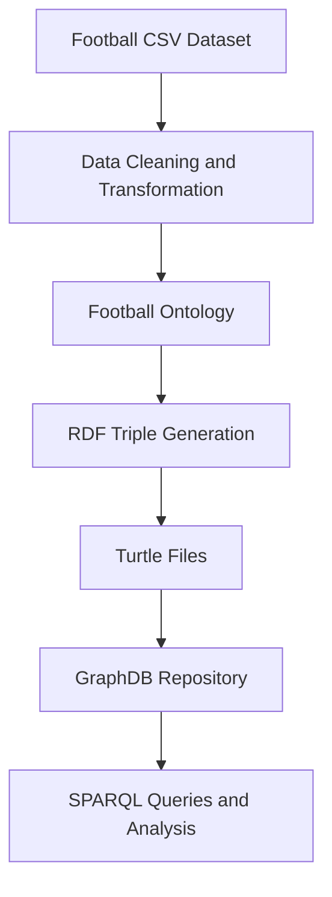

# Football Knowledge Graph

A semantic knowledge graph that transforms structured football data into RDF and enables graph-based exploration using SPARQL and GraphDB.

The project models football-related entities—including players, clubs, competitions, matches, appearances, line-ups, game events, countries, and market valuations—and connects them through a custom football ontology.

## Project Overview

Traditional CSV-based football datasets are useful for statistical analysis, but relationships among entities can be difficult to explore. This project represents those relationships as a knowledge graph, making it possible to retrieve and analyse connected football information using semantic queries.

The project was developed as part of the **Database 2** course in the **Master’s Degree in Computer Engineering** at the **University of Padua, Italy**.

## Main Features

- Custom OWL/RDF ontology for the football domain
- Football data cleaning and preprocessing with Python and Pandas
- Conversion of CSV records into RDF triples
- RDF serialization in Turtle (`.ttl`) format
- Knowledge graph storage and exploration using GraphDB
- SPARQL queries for retrieving and analysing football information
- Analysis of football players and their market values
- Visual representation of the ontology and its class hierarchy

## Knowledge Graph Domain

The ontology represents the following primary entities:

- **Player**
- **Club**
- **Competition**
- **Game**
- **Appearance**
- **Game Event**
- **Game Line-up**
- **Valuation**
- **Country**

These entities are connected through relationships describing:

- Players and their clubs
- Clubs and domestic competitions
- Games and participating clubs
- Player appearances in individual games
- Goals, substitutions, assists, and other game events
- Starting line-ups and substitute players
- Player positions and jersey numbers
- Historical player market valuations
- Countries associated with players, clubs, and competitions

## Project Workflow



The project is divided into three main stages:

### 1. Ontology Design

- Define the football domain
- Identify the main classes, properties, and relationships
- Create the OWL/RDF football ontology
- Visualize the ontology and its class hierarchy

### 2. Data Processing and Serialization

- Load football data from CSV files
- Clean and transform the data using Pandas
- Map dataset records to ontology classes and properties
- Generate RDF triples using RDFLib
- Serialize the resulting graphs in Turtle format

### 3. Graph Querying and Analysis

- Import the ontology and generated Turtle files into GraphDB
- Execute SPARQL queries
- Explore relationships among players, clubs, games, and competitions
- Analyse player performance and market-value information

## Technologies Used

- **Python**
- **Jupyter Notebook**
- **Pandas**
- **NumPy**
- **RDFLib**
- **RDF**
- **RDFS**
- **OWL**
- **Turtle**
- **SPARQL**
- **GraphDB**
- **Git LFS**

## Dataset

The project uses the following football dataset from Kaggle:

[Football Data from Transfermarkt](https://www.kaggle.com/datasets/davidcariboo/player-scores)

The dataset contains information about:

- Players
- Clubs
- Competitions
- Games
- Player appearances
- Game events
- Game line-ups
- Player market valuations

## Repository Structure

```text
KnowledgeGraphProject/
├── Analysis/
│   ├── csv/                              # Data used for analysis
│   └── db2.ipynb                         # Football data analysis notebook
│
├── GraphDB/
│   ├── class-hierarchy-FootballOntology.svg
│   └── graphDBStatements.rdf             # Exported GraphDB statements
│
├── VisualGraph/
│   └── FootballOntology.jpg              # Ontology visualization
│
├── code/
│   ├── FootballOntologyProjUpdated.rdf   # Football ontology
│   └── serialization-code.ipynb          # CSV-to-RDF serialization pipeline
│
├── csv/
│   ├── output/                           # Generated Turtle files
│   ├── appearance.csv
│   ├── club_games.csv
│   ├── clubs.csv
│   ├── competitions.csv
│   ├── game_events.csv
│   ├── game_lineups.csv
│   ├── games.csv
│   ├── player_valuations.csv
│   └── players.csv
│
├── queries/
│   └── SparqlQueries.pdf                 # SPARQL queries and results
│
├── DB2-Presentation.pptx                 # Project presentation
└── README.md
```

## Generated RDF Files

The serialization process generates separate Turtle files for the main parts of the knowledge graph:

```text
csv/output/
├── Appearances.ttl
├── GameEvents.ttl
├── GameLineUp.ttl
├── club.ttl
├── competitions.ttl
├── games.ttl
├── player.ttl
└── valuation.ttl
```

## Getting Started

### Prerequisites

Install the following software before running the project:

- Python 3
- Jupyter Notebook or JupyterLab
- GraphDB
- Git
- Git LFS

### 1. Clone the Repository

```bash
git clone https://github.com/Irfankhan132/MyWork.git
cd MyWork/KnowledgeGraphProject
```

### 2. Download Git LFS Files

Some RDF and Turtle files are larger than GitHub’s standard file-size limit and are stored using Git LFS.

```bash
git lfs install
git lfs pull
```

### 3. Create a Virtual Environment

```bash
python -m venv venv
```

Activate the environment on Windows:

```bash
venv\Scripts\activate
```

Activate the environment on Linux or macOS:

```bash
source venv/bin/activate
```

### 4. Install the Required Libraries

```bash
pip install pandas numpy rdflib jupyter
```

### 5. Configure the Dataset Path

Open the following notebook:

```text
code/serialization-code.ipynb
```

Update the dataset path in the notebook so that it points to the local `csv` directory.

For example:

```python
from pathlib import Path

project_path = Path.cwd().parent
csv_path = project_path / "csv"
output_path = csv_path / "output"
```

### 6. Run the Serialization Notebook

Start Jupyter Notebook:

```bash
jupyter notebook
```

Open `code/serialization-code.ipynb` and execute the cells in order.

The notebook will:

1. Load the CSV datasets.
2. Clean and transform the data.
3. Create RDF resources and literals.
4. Map the records to the football ontology.
5. Generate RDF triples.
6. Serialize the graphs into Turtle files.

The generated files are saved in:

```text
csv/output/
```

## Loading the Knowledge Graph into GraphDB

1. Start GraphDB.
2. Create a new GraphDB repository.
3. Import the football ontology:

```text
code/FootballOntologyProjUpdated.rdf
```

4. Import the generated Turtle files from:

```text
csv/output/
```

5. Open the GraphDB SPARQL editor.
6. Execute SPARQL queries against the imported knowledge graph.

Examples of the developed queries and their results are available in:

```text
queries/SparqlQueries.pdf
```

## Example SPARQL Queries

### Retrieve Players and Their Market Values

```sparql
PREFIX fo: <http://www.dei.unipd.it/database2/FootballOntology#>

SELECT ?player ?marketValue
WHERE {
    ?player a fo:Player ;
            fo:marketValue ?marketValue .
}
ORDER BY DESC(?marketValue)
LIMIT 20
```

### Retrieve Games and Their Scores

```sparql
PREFIX fo: <http://www.dei.unipd.it/database2/FootballOntology#>

SELECT ?game ?homeGoals ?awayGoals
WHERE {
    ?game a fo:Game ;
          fo:homeClubGoals ?homeGoals ;
          fo:awayClubGoals ?awayGoals .
}
LIMIT 20
```

### Retrieve Player Appearances

```sparql
PREFIX fo: <http://www.dei.unipd.it/database2/FootballOntology#>

SELECT ?appearance ?playerName ?minutesPlayed
WHERE {
    ?appearance a fo:Appearance ;
                fo:playerName ?playerName ;
                fo:minutesPlayed ?minutesPlayed .
}
ORDER BY DESC(?minutesPlayed)
LIMIT 20
```

### Retrieve Game Events

```sparql
PREFIX fo: <http://www.dei.unipd.it/database2/FootballOntology#>

SELECT ?event ?eventType ?minute ?description
WHERE {
    ?event a fo:GameEvent ;
           fo:eventType ?eventType ;
           fo:minute ?minute ;
           fo:description ?description .
}
ORDER BY ?minute
LIMIT 20
```

## Learning Outcomes

This project demonstrates practical experience in:

- Designing a domain-specific ontology
- Modelling structured information as a knowledge graph
- Transforming CSV data into RDF triples
- Working with namespaces, URIs, literals, and XML Schema datatypes
- Serializing RDF data in Turtle format
- Managing and exploring semantic data in GraphDB
- Writing SPARQL queries for connected data
- Combining semantic technologies with conventional data analysis

## Future Improvements

Possible future extensions include:

- Replace fixed local paths with a portable configuration
- Add automated data validation and error handling
- Introduce SHACL shapes for validating RDF data
- Connect serialized entities through additional object properties
- Add executable `.sparql` query files
- Develop an interactive dashboard for graph exploration
- Create a REST API for accessing the knowledge graph
- Integrate the graph with a question-answering or Graph RAG system
- Add automated tests for the serialization pipeline

## License

The contents of this project are shared under the [Creative Commons Attribution-ShareAlike 4.0 International License](https://creativecommons.org/licenses/by-sa/4.0/).

## Author

**Irfan Khan**

Master’s in Computer Engineering  
University of Padua, Italy

GitHub: [Irfankhan132](https://github.com/Irfankhan132)
